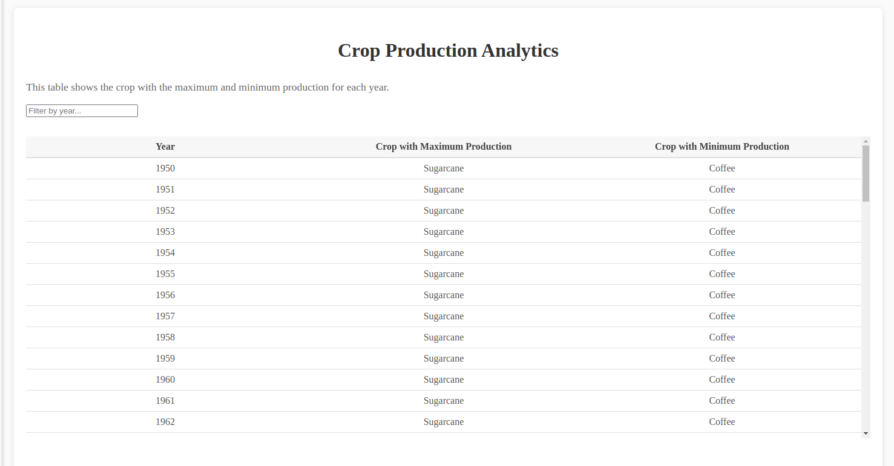
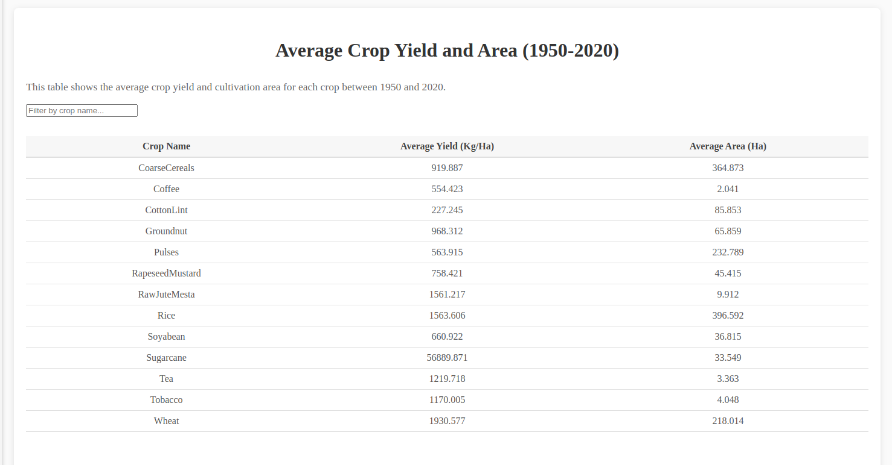

# Production and Average Crop Analytics

## Overview

**Production and Average Crop Analytics** is a data-driven platform designed to provide insights into crop production and performance. By aggregating data from various sources, the tool enables users to analyze crop yield, average production, trends, and other key metrics. This helps farmers, researchers, and policymakers make informed decisions to improve agricultural productivity.

You can access the live version of the platform here: [Production and Average Crop Analytics](https://manufac-master-pc6o.vercel.app/)

## Features

- **Crop Production Analysis**: Visualize production data by crop, year, season, and more.

  

- **Average Yield Calculation**: Calculate and display the average yield per crop across different conditions.

  

## Technology Stack

- **Frontend**: React.js with [Mantine UI](https://mantine.dev/) for components and styling
- **Tools**: Lodash for utility functions

## Getting Started

1. **Clone the repository**

   ```bash
   git clone https://github.com/sibbala-potheesh/manufac-master.git
   ```

2. **Install the dependencies**

   ```bash
   yarn install
   ```

3. **To Run the application**

   ```bash
   yarn dev
   ```

4. **To build the application**

   ```bash
   yarn build
   ```
